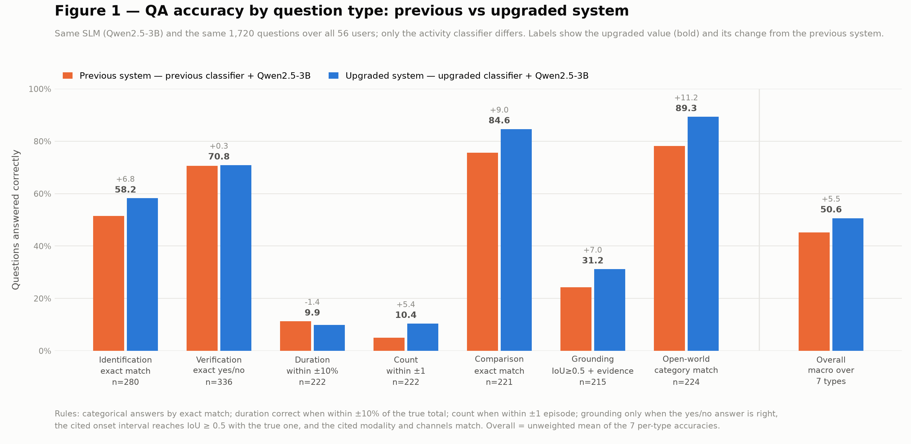
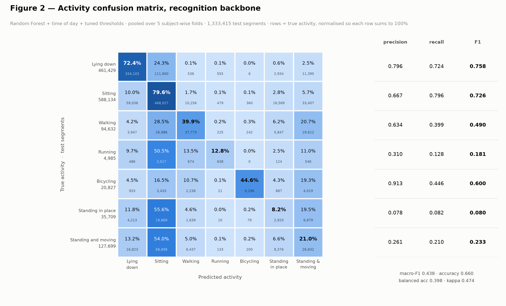
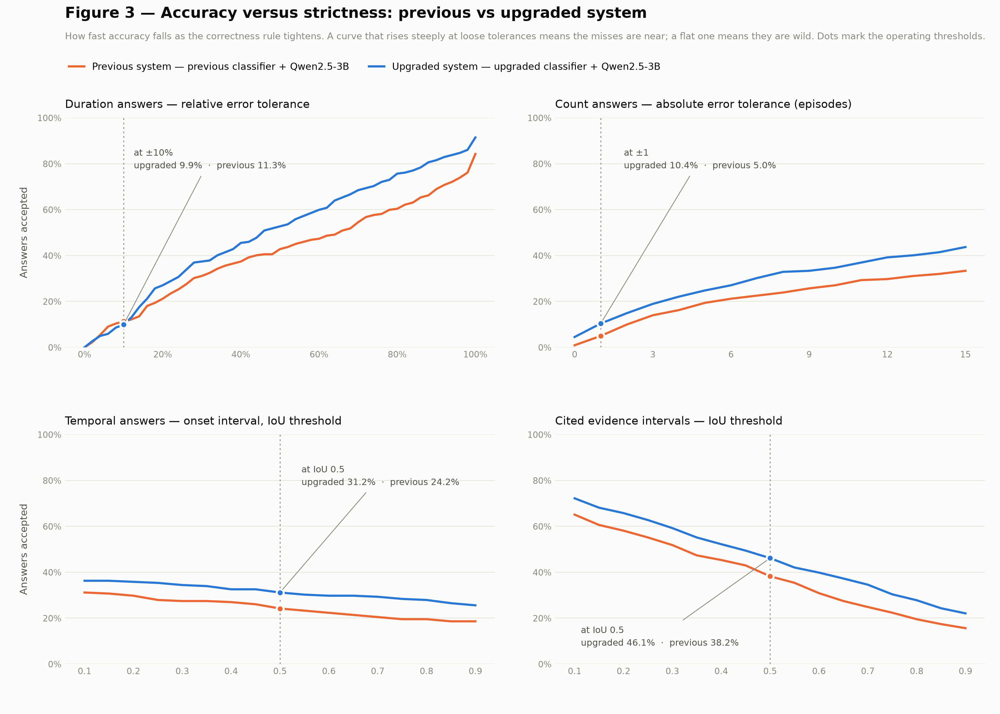
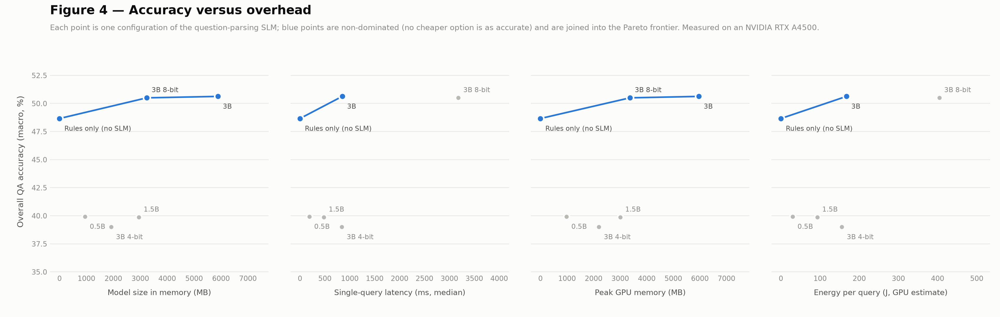
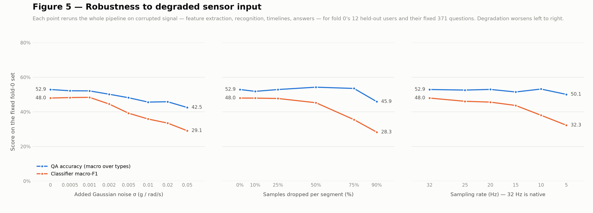

# Final_result — required figures and metrics

Evaluation of the complete *Ask the Sensors* system, following the challenge's
"Accuracy Reporting and Required Figures" section. Everything here reads the
project read-only and writes only inside `Final_result/`.

**System evaluated.** Recognition backbone = Random Forest + time-of-day features
+ validation-tuned class thresholds (from `Try_increase_accuracy/`). Query engine =
Qwen2.5-3B-Instruct for question parsing; every number in an answer is computed in
Python from the activity timeline. Sampling rate 32 Hz. Time base: seconds from the
start of each user's recording.

**Evaluation set.** 1,720 questions over **all 56 users**, every user answered from
a timeline built on predictions made by a model that never saw them (5-fold,
subject-wise). Questions are generated from the ground-truth labels with grammatical
templates and paraphrases; answers are known by construction.

## Headline

**Overall QA accuracy: 50.6%** — the fraction of questions correct under each
type's own rule, macro-averaged over the 7 question types. Before the backbone
upgrade it was 45.2%.

| question type | n | correctness rule | final | before upgrade | perfect parsing |
|---|---|---|---|---|---|
| Identification | 280 | exact match | 58.2% | 51.4% | 58.2% |
| Verification | 336 | exact yes/no | 70.8% | 70.5% | 72.6% |
| Duration | 222 | within ±10% | 9.9% | 11.3% | 9.9% |
| Count | 222 | within ±1 | 10.4% | 5.0% | 10.4% |
| Comparison | 221 | exact match | 84.6% | 75.6% | 88.2% |
| Grounding | 215 | answer + IoU≥0.5 + modality/channels | 31.2% | 24.2% | 31.2% |
| Open-world | 224 | categorical match | 89.3% | 78.1% | 89.3% |
| **Overall (macro)** | 1,720 | | **50.6%** | 45.2% | 51.4% |

"Perfect parsing" hands the true intent to the resolver. It scores only 0.8 points
higher, so **the SLM is not the bottleneck** — Qwen parses 98.5% of questions
correctly. The remaining error lives in the recognition backbone and the timeline.

Full metric tables: [`tables/qa_metrics.md`](tables/qa_metrics.md),
[`tables/overhead.md`](tables/overhead.md), `tables/robustness.json`.

## Figure 1 — Accuracy by question type


**Previous system** (previous classifier + Qwen2.5-3B) against the **upgraded
system** (upgraded classifier + Qwen2.5-3B): same SLM, same 1,720 questions, only
the activity classifier differs. Overall QA accuracy rises from 45.2% to 50.6%,
**+5.5 points** (5.47 exactly). Six of the seven question types improve, most of all
open-world (+11.2), comparison (+9.0) and grounding (+7.0); duration falls 1.4 points,
because the tuned thresholds make the classifier more cautious about Walking and
Bicycling, so their total times come out lower.

## Figure 2 — Activity confusion matrix


Pooled over 5 folds, 1,333,415 test segments: accuracy 0.660, macro-F1 0.438,
balanced accuracy 0.398, kappa 0.474. The dominant remaining confusions are
**Standing in place → Sitting (55.6%)**, **Standing and moving → Sitting (54.0%)**
and **Running → Sitting (50.5%)** — a still or pocketed phone looks alike across
these activities.

## Figure 3 — Accuracy versus strictness


Previous system against upgraded system, in four panels:

| answer kind | operating point | previous | upgraded |
|---|---|---|---|
| duration | within ±10% | 11.3% | 9.9% |
| count | within ±1 | 5.0% | 10.4% |
| temporal — onset interval | IoU ≥ 0.5 | 24.2% | 31.2% |
| cited evidence intervals | IoU ≥ 0.5 | 38.2% | 46.1% |

The upgraded system is ahead at every tolerance and threshold, with one exception:
duration at tolerances between ±4% and ±10%, where the previous system is
marginally ahead. From there the upgraded curve pulls clearly away, which means its
duration misses are *nearer* the truth even though fewer land inside ±10%. In both
systems duration misses are **moderate, not wild** (upgraded MAPE 71.5%), while count
stays low even at ±15 episodes, because the predicted timeline is still more
fragmented than the truth.

## Figure 4 — Accuracy versus overhead


| configuration | size (MB) | latency (ms) | peak VRAM (MB) | energy (J/query) | intents correct | QA accuracy |
|---|---|---|---|---|---|---|
| Rules only (no SLM) | 0 | 0 | 0 | 0.0 | 95.1% | 48.7% |
| Qwen2.5-0.5B fp16 | 942 | 187 | 979 | 29.9 | 71.2% | 39.9% |
| Qwen2.5-1.5B fp16 | 2,944 | 479 | 3,006 | 93.0 | 80.5% | 39.9% |
| Qwen2.5-3B 4-bit | 1,917 | 840 | 2,202 | 155.7 | 73.3% | 39.0% |
| Qwen2.5-3B 8-bit | 3,240 | 3,181 | 3,365 | 404.5 | 98.3% | 50.5% |
| **Qwen2.5-3B fp16** | 5,886 | 848 | 5,961 | 167.3 | 98.5% | **50.6%** |

Measured one query at a time on an NVIDIA RTX A4500 (20 GB), full answer path.
Two findings worth reporting:

- **Small SLMs are worse than no SLM.** A model that returns a valid but wrong
  intent overrides the keyword rules, so 0.5B, 1.5B and 3B-4-bit all fall below the
  rules-only baseline. Only full-precision or 8-bit 3B clears it.
- **8-bit is slower than full precision here** — 3.2 s vs 0.85 s — because
  bitsandbytes' int8 matrix multiply has large overhead on this GPU. It saves memory,
  not time. The Pareto frontier is rules-only → 3B 8-bit → 3B fp16 on size and
  memory, and rules-only → 3B fp16 on latency and energy.

## Figure 5 — Robustness curve


- **Sensor noise (absolute σ, g / rad/s):** no effect up to **0.001** — typical
  phone accelerometer noise — where macro-F1 is 0.484 against 0.480 clean. It
  degrades from **0.002**, where accuracy falls 0.674 → 0.589, and reaches F1 0.291 /
  QA 42.5% at 0.05. The threshold is not arbitrary: the motion inside a still
  segment is itself ~0.001–0.002 g, so once noise matches that scale, lying and
  sitting stop *looking* still. (A first run scaled σ by each channel's global std;
  that std is dominated by phone orientation, ~0.3–0.6 g, so even its mildest level
  swamped the signal. It was discarded in favour of absolute units.)

Each point reruns the entire pipeline — feature extraction, recognition, timelines,
answers — on corrupted signal, for fold 0's 12 held-out users and their fixed 371
questions. The retrained fold-0 model was checked to reproduce the final model's
probabilities exactly before any degradation.

- **Dropped samples:** macro-F1 barely moves up to 50% missing (0.480 → 0.453) and
  degrades only beyond 75% (0.283 at 90%).
- **Sampling rate:** at **25 Hz, the brief's standard rate, macro-F1 drops only
  0.019** (0.480 → 0.461). QA accuracy stays between 50% and 53% down to 5 Hz.
- **QA accuracy is steadier than classifier F1**, because several question types
  (comparisons, prolonged rest, overall activity level) depend on aggregate totals
  dominated by the robust sedentary classes. At 371 questions, QA points carry a few
  points of sampling noise, which is why those curves are not strictly monotone.

## Other metrics the brief requires

**Categorical — identification as a 7-class problem:** accuracy 58.2%, macro-F1
0.350, balanced accuracy 0.338.

**Binary verification (positive = Yes):** accuracy 70.8%, precision 0.807,
recall 0.548, F1 0.652, **specificity 0.869**. The gap between specificity and
recall is the bias toward answering "no" that the brief warns plain accuracy hides.

**Numeric:** duration 9.9% within ±10%, MAE 18,250 s, MAPE 71.5%, median absolute
error 9,326 s. Count 10.4% within ±1, MAE 40.9 episodes, median 22.

**Evidence grounding — the price of demanding evidence:**

| type | n | answer correct | grounded & correct | gap | grounding precision |
|---|---|---|---|---|---|
| Identification | 280 | 58.2% | 42.5% | 15.7 pts | 82.6% |
| Verification | 168 | 54.8% | 29.8% | 25.0 pts | 83.7% |
| Duration | 222 | 9.9% | 4.5% | 5.4 pts | 57.7% |
| Grounding | 167 | 91.6% | 23.4% | 68.3 pts | 47.1% |
| Open-world | 127 | 87.4% | 48.8% | 38.6 pts | 92.5% |
| **all** | 964 | 56.1% | 29.0% | **27.1 pts** | 68.8% |

The system usually knows *that* an activity happened (91.6% on "did the user begin
X?") but cites the wrong time for its first occurrence: the median IoU of the cited
onset interval is 0.000. Grounding precision — whether a cited interval truly
contains the activity named — is 68.8% overall.

## Definitions and caveats — read before quoting these numbers

1. **Episode rule.** An activity episode must last at least 60 s (one window). It is
   applied identically to the ground truth and to predictions, so both are judged by
   one definition. Ground truth is *not* smoothed.
2. **Templated questions favour the rule parser.** The question set is generated from
   templates with paraphrases, which is why keyword rules parse 95.1% correctly. On
   genuinely free-form questions from people, the rule parser would degrade and the
   SLM's advantage in Figure 4 would widen. A hand-written question set is the way to
   measure that.
3. **Modality and channels** are always "Accelerometer, Gyroscope" / "All", both in
   the reference and in the system's answers, so that part of the grounding rule is
   always satisfied; in practice the rule is decided by the IoU.
4. **Time of day** needs wall-clock timestamps. If the evaluation recordings carry
   only relative time, the backbone falls back to the no-time model (see
   `Try_increase_accuracy/README.md`).
5. **Sampling rate is 32 Hz**, not the brief's 25 Hz. Figure 5 measures the cost of
   running at 25 Hz: macro-F1 −0.019.
6. **Energy** is an estimate: mean GPU board power (nvidia-smi) × median latency. It
   excludes CPU and does not subtract idle power.
7. **Not produced:** the 1–5 rubric score for open-world explanations. The brief
   allows either human graders or a language model with a fixed rubric; neither was
   run here.

## Reproduce

```bash
cd Final_result
python3 01_build_eval_set.py     # ground truth, 1,720 questions, timelines
python3 02_parse.py qwen3b rules qwen0.5b qwen1.5b qwen3b_8bit qwen3b_4bit
python3 03_score.py              # QA metrics tables
python3 04_figures_123.py        # Figures 1-3
python3 05_overhead.py           # Figure 4
python3 06_robustness.py         # Figure 5 data (fold 0)
python3 07_figure5.py            # Figure 5
```
