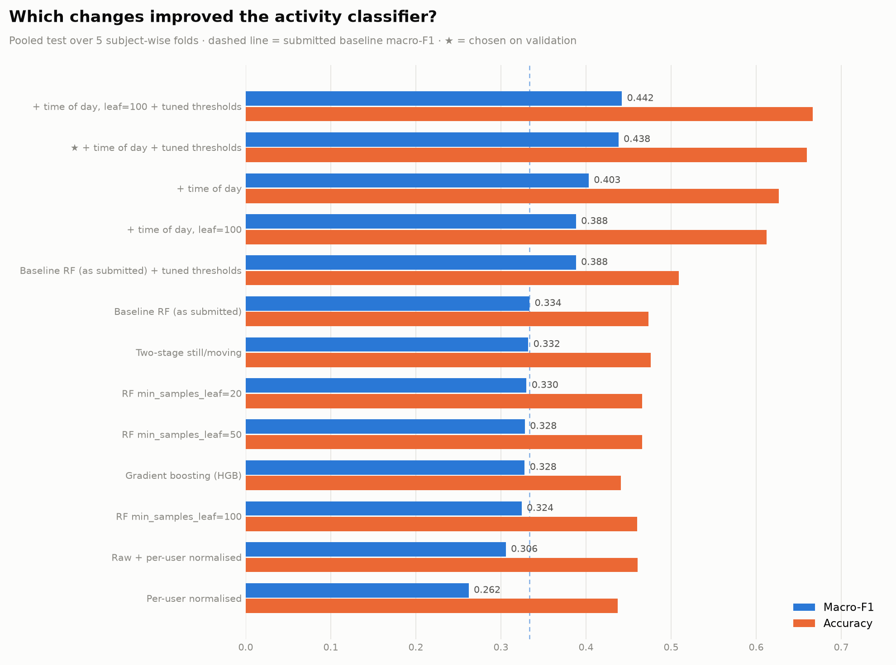

# Try_increase_accuracy

Experiments to improve the 7-class activity classifier, run **entirely inside this
folder**. Nothing in the parent project was modified: the original models,
datasets, results and notebooks are read-only here (verified — see the end).

## Result

**Yes, accuracy and macro-F1 both increased.** Pooled over all 5 subject-wise
folds (1,333,415 test segments, every user tested exactly once):

| metric | submitted RF | improved | change |
|---|---|---|---|
| accuracy | 0.4733 | **0.6597** | **+0.1864** |
| macro-F1 | 0.3337 | **0.4382** | **+0.1045** |
| balanced accuracy | 0.3566 | **0.3979** | +0.0413 |
| Cohen's kappa | 0.2096 | **0.4744** | +0.2648 |

Per-fold mean ± std: accuracy 0.6610 ± 0.0126, macro-F1 0.4449 ± 0.0385,
balanced accuracy 0.4193 ± 0.0394, kappa 0.4740 ± 0.0209.

**The improved configuration** = the submitted Random Forest, unchanged, plus
**two time-of-day features** and **per-class decision weights tuned on
validation**. It was chosen by validation macro-F1; test numbers were never used
to choose.

### Per class

| activity | F1 before | F1 after | recall before | recall after |
|---|---|---|---|---|
| Lying down | 0.364 | **0.758** | 0.255 | **0.724** |
| Sitting | 0.601 | **0.726** | 0.713 | 0.796 |
| Walking | 0.454 | 0.490 | 0.580 | 0.399 |
| Running | 0.106 | 0.181 | 0.090 | 0.128 |
| Bicycling | 0.562 | 0.600 | 0.608 | 0.446 |
| Standing in place | 0.070 | 0.080 | 0.065 | 0.082 |
| Standing and moving | 0.180 | 0.233 | 0.185 | 0.210 |

Every class's F1 improved. Walking and Bicycling **recall** fell: the tuned
weights make the model more conservative about predicting them, trading recall
for precision, which is what raises their F1.

### It also improves the question-answering system

Same 453 benchmark questions (fold 0), answered from each model's timeline:
macro QA accuracy **44.3% → 50.2%**. Six of seven question types improved
(open-world +19.4 points); **verification fell 4.2 points**, a consequence of the
lower Walking/Bicycling recall. Count (6%) and duration (13%) questions remain
poor — they are limited by timeline fragmentation, not by the classifier.

## ⚠️ Before you adopt it — the time-of-day caveat

Almost all of the gain comes from **time of day**. From the true labels across all
users, 74.3% of lying-down minutes fall between 22:00 and 07:00, against 15.1% of
sitting minutes — and Lying down ↔ Sitting confusion was 47.6% of all the
submitted model's errors.

Two things to settle before relying on it:

1. **Is it allowed?** The brief restricts the system to accelerometer and
   gyroscope. Time of day comes from the recording's timestamps, not a sensor. It
   is a grey area — ask the instructor.
2. **Will the evaluation data have it?** It needs **wall-clock** time. The brief
   allows timestamps as seconds from the start of the recording; if the grading
   recordings carry only relative time, this feature is unavailable exactly when
   it matters, and you fall back to the no-time numbers below.

**If time of day is not allowed**, the best configuration is the submitted RF +
tuned thresholds alone: accuracy 0.5088, macro-F1 **0.3882** (+0.0545) — still a
real improvement, needing no retraining and no extra data.

## All experiments

Selection by validation macro-F1 (`results/summary.md` has the full table).

| experiment | val F1 | test acc | test macro-F1 | verdict |
|---|---|---|---|---|
| Baseline RF (as submitted) | 0.2737 | 0.4733 | 0.3337 | reproduces the notebook exactly |
| + tuned thresholds | 0.3866 | 0.5088 | 0.3882 | **helps** (+0.0545) |
| + prior correction | 0.2962 | 0.5155 | 0.3042 | raises accuracy, lowers macro-F1 |
| + time of day | 0.3604 | 0.6265 | 0.4032 | **helps most** (+0.0695) |
| **+ time of day + tuned thresholds** | **0.4313** | **0.6597** | **0.4382** | **selected** (+0.1045) |
| + time of day, leaf=100 + tuned | 0.4266 | 0.6666 | 0.4422 | equal within noise; lower val |
| RF min_samples_leaf 20 / 50 / 100 | 0.278–0.283 | ~0.46 | 0.324–0.330 | no gain |
| Histogram gradient boosting | 0.2788 | 0.4408 | 0.3279 | no gain |
| Two-stage (still/moving first) | 0.2744 | 0.4761 | 0.3321 | no gain |
| Per-user normalisation (+raw) | 0.2215 / 0.2545 | 0.44 / 0.46 | 0.262 / 0.306 | **hurts** |



### Why some suggestions failed

- **Per-user normalisation measured lifestyle, not sensors.** A user's average
  motion level correlates r = +0.50 with how much of their day they spend moving,
  and varies 9× across users (they move between 1% and 48% of the time).
  Normalising per user subtracts each person's habits — making an active person's
  walking look "average" — and throws away the physical scale ("acceleration std
  below 0.005 g means still") that holds for everyone.
- **Regularisation and gradient boosting** changed little: the bottleneck is
  information (a still phone looks the same whether its owner lies or sits), not
  model capacity or overfitting.
- **The two-stage classifier** didn't help because the still/moving boundary isn't
  where the errors are — they're *within* the still group.

## How to use the improved model

```bash
cd Try_increase_accuracy
python3 build_timelines_improved.py 9DC38D04      # or --all
cd ..
python3 ask.py --timeline Try_increase_accuracy/timelines/<uuid>.json "Did she lie down for long?"
```

`final_model/predictions.npz` uses the same keys as `../rf_results/predictions.npz`,
so it drops in anywhere the original predictions are used.

## Files

| file | purpose |
|---|---|
| `common.py` | shared helpers; reads `../rf_features` read-only |
| `reconstruct_wtr.py` | recovers training window ids by replaying the RF notebook's deterministic selection; verified exact |
| `run_experiments.py` | trains every experiment on identical folds |
| `tune_thresholds.py` | prior correction and validation-tuned class weights |
| `summarize.py` | comparison table and chart |
| `final_model.py` | packages the selected configuration |
| `qa_compare.py` | QA benchmark with both models' timelines |
| `build_timelines_improved.py` | timelines from the improved model |
| `results/` | per-experiment JSON, logs, `summary.md`, `comparison.png` |
| `final_model/` | `predictions.npz`, `metrics.json`, `confusion_matrix.png` |
| `cache/` | recovered windows, priors, per-user stats, saved probabilities |

## Reproducibility

The baseline reproduces the submitted notebook **to four decimals**
(accuracy 0.4733, macro-F1 0.3337, balanced accuracy 0.3566, kappa 0.2096),
using the same cached features, folds and `random_state=0`. Every experiment
changes one thing against that baseline.
